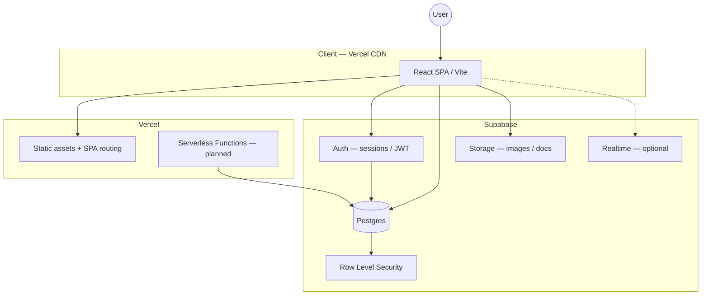
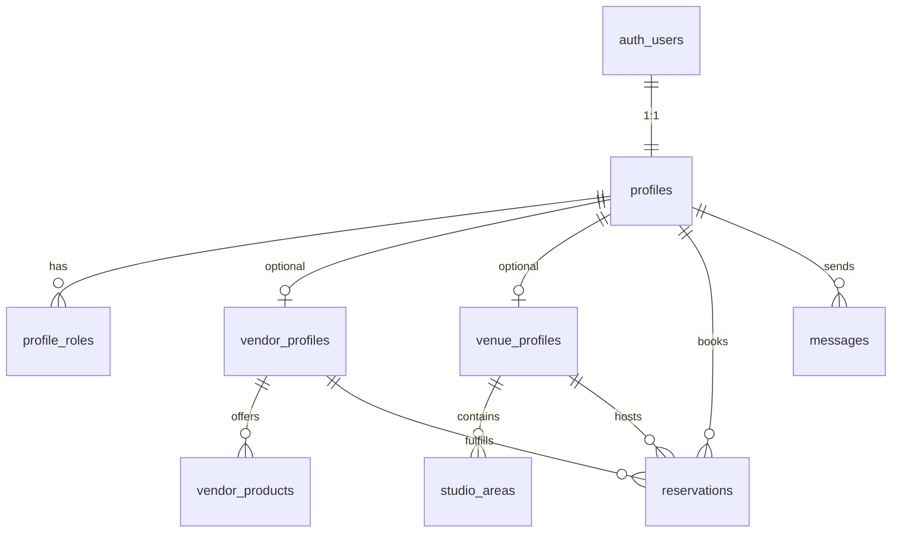

# PopupConnect — System Architecture

This document describes how PopupConnect is structured and how **Supabase** provides authentication, account data, and the primary backend for the product. Update this file when auth, database schema, or deployment patterns change.

## Product summary

PopupConnect connects **local enterprises (vendors)** with **venues (hosts)** so organizers and communities can discover, book, and run pop-up experiences. The web app is a **Vite + React + TypeScript** SPA deployed on **Vercel**. Business data and accounts live in **Supabase** (Postgres + Auth).

## High-level architecture



| Layer | Technology | Responsibility |
|-------|------------|----------------|
| UI | React 19, React Router, Tailwind CSS v4 | Pages, components, client routing |
| Hosting | Vercel | Build, deploy, env vars, SPA rewrites (`vercel.json`) |
| Identity | Supabase Auth | Sign-up, sign-in, sessions, OAuth (as enabled) |
| Data | Supabase Postgres | Profiles, roles, vendors, venues, bookings, messages |
| Authorization | Postgres RLS + policies | Users only read/write rows they are allowed to |
| Files | Supabase Storage | Avatars, vendor gallery, “my docs” uploads |
| API boundary | `@supabase/supabase-js` (+ Vercel Functions when needed) | Typed access from client; privileged ops on server |

## Why Supabase

- **Auth and database in one place** — `auth.users.id` is the foreign key for all account-owned rows.
- **Relational model** fits reservations, multiple studio areas, and multiple vendor products better than a document-only store.
- **Row Level Security (RLS)** enforces vendor vs host vs organizer access at the database, not only in the UI.
- **Good fit for Vercel** — SPA uses the anon key + user JWT; secrets stay in environment variables.

## User personas and account model

From product requirements (`ProjectDeliverables.md`):

| Persona | Account needs | Data ownership (conceptual) |
|---------|----------------|-----------------------------|
| **Vendor / artist** | Profile, gallery, products/services | `vendor_profiles`, `vendor_products`, media in Storage |
| **Space owner (host)** | Business/location profile, studio areas | `venue_profiles`, `studio_areas` |
| **Organizer / customer** | Profile, events, bookings | `profiles`, `reservations`, `events` |
| **Any signed-in user** | Privacy, messages, documents | `profiles`, `conversations` / `messages`, `user_documents` |

A single human may hold **multiple roles** (e.g. vendor and host). Recommended pattern:

- One row in `profiles` per `auth.users.id`
- Role membership in `profile_roles` (`vendor`, `host`, `organizer`) or separate boolean flags derived at onboarding
- Role-specific tables reference `profile_id`, not duplicate auth users

## Authentication flow (target)

1. User opens sign-in / sign-up (Supabase-hosted UI or custom forms using Supabase Auth).
2. Supabase returns a **session** (access JWT + refresh token).
3. SPA stores session via Supabase client (`@supabase/supabase-js`); `onAuthStateChange` drives React context.
4. Protected routes (`/account/*`, host/vendor dashboards) require a valid session.
5. Each request to Postgres includes the user JWT; **RLS policies** use `auth.uid()`.

**Rules:**

- Never expose `SUPABASE_SERVICE_ROLE_KEY` in the client bundle.
- Use the **anon** key in the browser; rely on RLS for data access.
- Use the **service role** only in trusted server code (Vercel Functions, migrations, admin scripts).

## Planned frontend structure

Current repo is UI-first; backend integration will extend layout as follows:

```
src/
  components/     # Presentational + shared UI
  pages/          # Route-level screens
  features/       # auth, account, vendor, venue, booking (planned)
  hooks/          # useSession, useProfile, useSupabase (planned)
  lib/            # supabase client, exploreSearch, utilities
  services/       # Thin wrappers over Supabase queries (planned)
  types/          # DB types (from Supabase CLI generate) (planned)
  config/         # Public config, image paths
```

## Database overview (conceptual schema)

Tables below are **planned** — implement via Supabase migrations. Names may change; relationships should remain stable.



| Table / area | Purpose |
|--------------|---------|
| `profiles` | Display name, avatar, contact, onboarding state |
| `profile_roles` | `vendor`, `host`, `organizer` |
| `vendor_profiles` | Public vendor page, bio, service area |
| `vendor_products` | Bookable offerings |
| `venue_profiles` | Location, amenities, policies |
| `studio_areas` | Multiple rentable spaces per venue |
| `reservations` | Booking lifecycle (draft → confirmed → cancelled) |
| `conversations` / `messages` | Messaging (Realtime optional) |
| `user_documents` | Metadata for Storage objects (“my docs”) |

Generate TypeScript types after migrations:

```bash
supabase gen types typescript --project-id <project-ref> > src/types/database.ts
```

## Authorization (RLS) principles

1. **Default deny** — enable RLS on all public tables; add explicit policies.
2. **Owner access** — `profile_id = auth.uid()` (or via join) for update/delete on own rows.
3. **Public read** — vendor/venue discovery rows readable when `published = true`.
4. **Booking rules** — guest, host, and vendor can read a reservation only if they are participants.
5. **Storage policies** — bucket paths scoped by `auth.uid()` (e.g. `{userId}/...`).

Policies live in SQL migrations under `supabase/migrations/` (to be added).

## Environment variables

| Variable | Where | Description |
|----------|--------|-------------|
| `VITE_SUPABASE_URL` | Client (Vite) | Project URL |
| `VITE_SUPABASE_ANON_KEY` | Client (Vite) | Public anon key (RLS-protected) |
| `SUPABASE_SERVICE_ROLE_KEY` | Vercel Functions only | Bypasses RLS — never in client |

See `.env.example` for a template. Configure the same variables in the Vercel project dashboard for production and preview.

## Deployment

| Environment | Frontend | Backend |
|-------------|----------|---------|
| Local | `npm run dev` | Supabase local or linked cloud project |
| Preview / Production | Vercel build → `dist/` | Supabase cloud project |

`vercel.json` rewrites all routes to `index.html` for client-side routing.

## Security checklist

- [ ] RLS enabled on every application table
- [ ] No service role key in frontend env (`VITE_*`)
- [ ] Auth required for `/account/*` and mutation endpoints
- [ ] Input validation on client and in DB constraints where possible
- [ ] Storage buckets private by default; signed URLs for sensitive docs

## Implementation phases

| Phase | Scope | Status |
|-------|--------|--------|
| **0** | UI skeleton (landing, explore, placeholders) | Done |
| **1** | Supabase project, Auth, `profiles`, session in SPA | Planned |
| **2** | Role onboarding (vendor / host / organizer), RLS for profiles | Planned |
| **3** | Vendor & venue profiles, gallery Storage | Planned |
| **4** | Reservations + availability | Planned |
| **5** | Messaging, notifications, automations | Planned |

## Mapping deliverables → architecture

| Deliverable (`ProjectDeliverables.md`) | Primary system pieces |
|----------------------------------------|------------------------|
| User personas | `profile_roles`, onboarding flows |
| Vendor profile / gallery | `vendor_profiles`, Storage, public read policies |
| Business location profile / studio areas | `venue_profiles`, `studio_areas` |
| Manage reservations | `reservations`, server-side validation |
| Customer profile | `profiles`, Auth user metadata |
| Messaging | `conversations`, `messages`, optional Realtime |
| Workflow automations | Edge Functions / cron (later) |

## Related documentation

| Document | Role |
|----------|------|
| [README.md](./README.md) | Setup, scripts, links |
| [ProjectDeliverables.md](./ProjectDeliverables.md) | Product scope and acceptance |
| [CodingFundamentals.md](./CodingFundamentals.md) | Code style; Supabase-specific rules |
| [.env.example](./.env.example) | Environment variable template |

## Decision log

| Date | Decision | Rationale |
|------|----------|-----------|
| 2026-05 | **Supabase** for auth + data | Relational bookings, RLS, single backend for team velocity on Vercel SPA |
| — | Firebase not adopted | Firestore weaker fit for reservations and multi-entity inventory |

---

*Last updated: architecture direction established for Supabase account system; schema and client SDK integration follow in Phase 1.*
